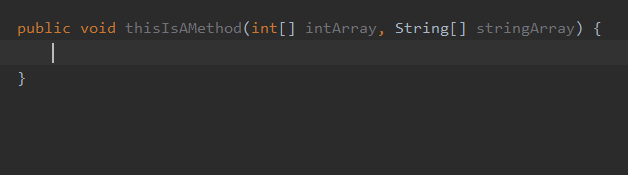

# Arrays

## arrayVariable()

Suggests all array variables applicable in the current scope.

There are examples for this in the iterations group of the Live Templates. The example below is for the template called `itar` whose purpose is to **Iterate elements of array**:

```java
for(int $INDEX$ = 0; $INDEX$ < $ARRAY$.length; $INDEX$++) {
  $ELEMENT_TYPE$ $VAR$ = $ARRAY$[$INDEX$];
  $END$
}
```

Its `$ARRAY$` variable is configured to use this (`arrayVariable()`) macro.

Given that there is at least one array in the current scope, e.g.:

```java
public void thisIsAMethod(int[] intArray, String[] stringArray) {
}
```

using the keyword `itar` will work the following, suggesting all array variables at the first occurrence of the appropriate
template variable:



By default it inserts the code snippet using the first array in the scope but along the way it can be changed easily from the suggestions list.

In case there is no array variable in the current scope, then the `$ARRAY$` variable is populated with the default name `array` and one has to create it manually.


**Related macro:** [ArrayVariableMacro](https://github.com/JetBrains/intellij-community/blob/master/java/java-impl/src/com/intellij/codeInsight/template/macro/ArrayVariableMacro.java)

## componentTypeOf(<array>)

Returns component type of an array.

There are examples for this in the iterations group of the Live Templates. The example below is for the template called `itar` whose purpose is to **Iterate elements of array**:

```java
for(int $INDEX$ = 0; $INDEX$ < $ARRAY$.length; $INDEX$++) {
  $ELEMENT_TYPE$ $VAR$ = $ARRAY$[$INDEX$];
  $END$
}
```

Its `$ELEMENT_TYPE$` variable is configured to use this (`componentTypeOf()`) macro: `componentTypeOf(ARRAY)` which also shows how one can reference a template variable in a live template function.
This one references the $ARRAY$ variable.

Given that there is at least one array in the current scope, e.g.:

```java
public void thisIsAMethod(int[] intArray, String[] stringArray) {
}
```

using the keyword `itar` will work the following, automatically populating the `$ELEMENT_TYPE$` variable with the object type that the selected array can store:

Although the inserted snippet uses the first available array and array type, upon selecting another array for the `$ARRAY$` variable, `$ELEMENT_TYPE$` also changes automatically. 


**Related macro:** [ComponentTypeOfMacro](https://github.com/JetBrains/intellij-community/blob/master/java/java-impl/src/com/intellij/codeInsight/template/macro/ComponentTypeOfMacro.java)

## iterableComponentType(<ArrayOrIterable>)

Returns the type of an iterable component, such as an array or a collection.

**Related macro:** [IterableComponentTypeMacro](https://github.com/JetBrains/intellij-community/blob/master/java/java-impl/src/com/intellij/codeInsight/template/macro/IterableComponentTypeMacro.java)

## iterableVariable()
	
Returns the name of a variable that can be iterated.

**Related macro:** [IterableVariableMacro](https://github.com/JetBrains/intellij-community/blob/master/java/java-impl/src/com/intellij/codeInsight/template/macro/IterableVariableMacro.java)
