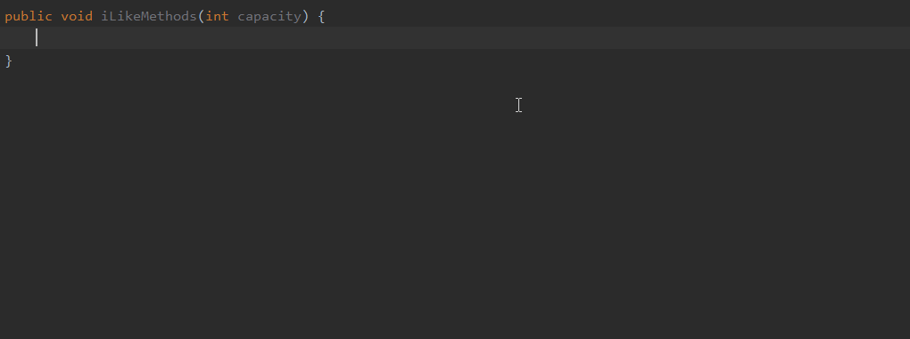
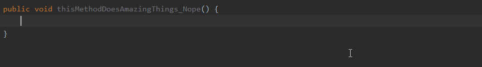
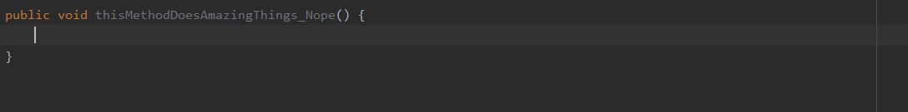
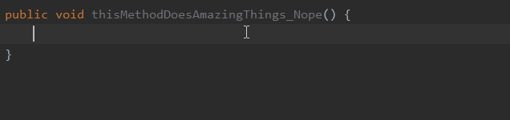
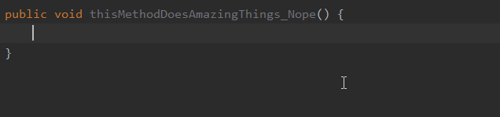
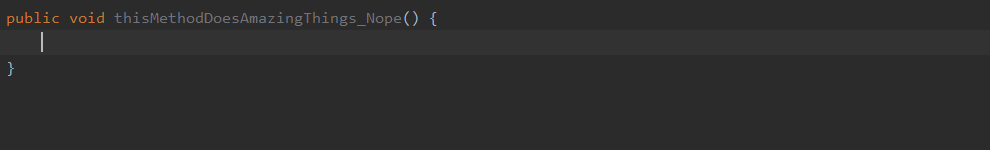

# Misc

## clipboard()

Just like what you'd expect, quoting the official documentation it *"Returns the contents of the system clipboard."*

**Related macro:** [ClipboardMacro](https://github.com/JetBrains/intellij-community/blob/master/platform/lang-impl/src/com/intellij/codeInsight/template/macro/ClipboardMacro.java)

## complete()

Invokes code completion at the position of the variable.

For the sake of an example let's say I would like a live template to create new `HashMap` instances with an initial capacity that I get passed in from somewhere.
A template can be:

```java
java.util.Map<String, String> $name$ = new java.util.HashMap<>($capacity$);
```

Then you can configure `$capacity$` with the `complete()` macro which will trigger the code completion:



**Official documentation:** [Code completion/Basic completion](https://www.jetbrains.com/help/idea/auto-completing-code.html#basic_completion)

**Related macro:** [CompleteMacro](https://github.com/JetBrains/intellij-community/blob/master/platform/lang-impl/src/com/intellij/codeInsight/template/macro/CompleteMacro.java)

## completeSmart()

Invokes smart type completion at the position of the variable.

Let's say you would like to create an instance of Google Guava's `StopWatch` including querying the elapsed time, which code snippet will surround your code to be developed.

For that you might assemble for the following template:

```java
com.google.common.base.Stopwatch stopwatch = Stopwatch.createStarted();
        
//do something

long elapsedTime = stopwatch.elapsed($timeunit$);
```

The only thing needing configuration is the `$timeunit$` variable whose Expression value will be `completeSmart()`. Then at the place of this variable
the smart type completion will appear.


**Official documentation:** [Code completion#Smart completion](https://www.jetbrains.com/help/idea/auto-completing-code.html#smart_completion)

**Related macro:** [CompleteSmartMacro](https://github.com/JetBrains/intellij-community/blob/master/platform/lang-impl/src/com/intellij/codeInsight/template/macro/CompleteSmartMacro.java)

## date(sDate)

Returns the current system date in the specified format.

Let's say, for some reason, you like to keep track when you did certain changes in your code and you'd like to insert the current date and/or time
as a comment or into your javadoc. For that a template might be:

```java
//Latest modification: $currentDate$
```

The only thing you need to configure is the Expression part of the `$currentDate$` variable which can be done multiple ways.

#### No date format

In case there is no parameter specific for the `date()` macro, as the official documentation also states
     
> the current date is returned in the default system format.

You can be on Mac, Unix or Windows, it will return the date in its default system format. All this logic is handled in `com.intellij.util.text.DateFormatUtil`.



#### Single custom date format

If you'd like to use a different date format you can pass in a date-time format String value that is according to the `java.text.SimpleDateFormat` specification.

Using the format `"Y-MM-d, E, H:m"` the result will change as following: 


**NOTE:** this example is made on a Hungarian language system, so the current day abbreviation is according to that: V for Vasárnap, Sunday in Hungarian. 

#### Multiple macro parameters

The macro takes only one parameter and ignores all extra parameters, but according to the macro implementation if you pass in more than one parameters,
it acts as if there were no parameters specified at all, falling back to the default system format.

#### Invalid date format

If you specify a custom date format string but it is not valid according to the `SimpleDateFormat` specification, e.g. `"Y-MM-d, E, H:mmmXSAm"`,
it returns an error message defined in the macro implementation, `com.intellij.codeInsight.template.macro.CurrentDateMacro`.



**Related macro:** [CurrentDateMacro](https://github.com/JetBrains/intellij-community/blob/master/platform/lang-impl/src/com/intellij/codeInsight/template/macro/CurrentDateMacro.java)

## groovyScript("groovy code", arg1)

Returns a Groovy script with the specified code.

**Related macro:** [GroovyScriptMacro](https://github.com/JetBrains/intellij-community/blob/master/platform/lang-impl/src/com/intellij/codeInsight/template/macro/GroovyScriptMacro.java)

## lineNumber()

Returns the line number at which the associated template parameter is positioned after invoking the live template.

Considering that the live template is invoked in the 11th line, the results would be the following:

| Template | Result  |
|---|---|
| <pre>lineNumber$</pre> | 11 |
| <pre>$start$<br><br><br>$lineNumber$</pre> | 14 |

**Related macro:** [LineNumberMacro](https://github.com/JetBrains/intellij-community/blob/master/platform/lang-impl/src/com/intellij/codeInsight/template/macro/LineNumberMacro.java)

## showParameterInfo

NOTE: This is not included in the official documentation at the moment.

**Related macro:** [ShowParameterInfoMacro](https://github.com/JetBrains/intellij-community/blob/master/platform/lang-impl/src/com/intellij/codeInsight/template/macro/ShowParameterInfoMacro.java)

## suggestFirstVariableName(sFirstVariableName)

Doesn't suggest true, false, this, super.

**Related macro:** [SuggestFirstVariableNameMacro](https://github.com/JetBrains/intellij-community/blob/master/java/java-impl/src/com/intellij/codeInsight/template/macro/SuggestFirstVariableNameMacro.java)

## suggestIndexName()

Suggests the name of an index variable from most commonly used ones: i, j, k, and so on (first one that is not used in the current scope).

**Related macro:** [SuggestIndexNameMacro](https://github.com/JetBrains/intellij-community/blob/master/java/java-impl/src/com/intellij/codeInsight/template/macro/SuggestIndexNameMacro.java)

## suggestVariableName()

Suggests the name for a variable based on the variable type and its initializer expression...

**Related macro:** [SuggestVariableNameMacro](https://github.com/JetBrains/intellij-community/blob/master/java/java-impl/src/com/intellij/codeInsight/template/macro/SuggestVariableNameMacro.java)

## time(sSystemTime)

Returns the current system time in the specified format.

The underlying logic is almost the same as in case of the `date(sDate)` macro because they are both handled in the `com.intellij.codeInsight.template.macro.CurrentDateMacro` class
in a common static method. The only difference is that in case of there is no parameter specified for `time(sSystemTime)`
the system default time is returned instead of the system default date.

For the sake of comprehensiveness I include all the cases from the `date(sDate)` macro here as well, of course extended with the `time` specific details.

Let's say, for some reason, you like to keep track when you did certain changes in your code and you'd like to insert the current time
as a comment or into your javadoc. For that a template might be:

```java
//Latest modification: $currentTime$
```

The only thing you need to configure is the Expression part of the `$currentTime$` variable which can be done multiple ways.

#### No time format

In case there is no parameter specific for the `time()` macro, as the official documentation also states
     
> the current time is returned in the default system format.

You can be on Mac, Unix or Windows, it will return the time in its default system format. All this logic is handled in `com.intellij.util.text.DateFormatUtil`.



#### Single custom time format

If you'd like to use a different time format you can pass in a date-time format String value that is according to the `java.text.SimpleDateFormat` specification.

Using the format `"H.mm"` the result will change as following: 



However nothing stops you from defining a complete date format as well because behind the scenes it uses a `SimpleDateFormat` to get the time.

`"Y-MM-d, E, H:m"`


**NOTE:** this example is made on a Hungarian language system, so the current day abbreviation is according to that: V for Vasárnap, Sunday in Hungarian. 

#### Multiple macro parameters

The macro takes only one parameter and ignores all extra parameters, but according to the macro implementation if you pass in more than one parameters,
it acts as if there were no parameters specified at all, falling back to the default system format.

#### Invalid time format

If you specify a custom time format string but it is not valid according to the `SimpleDateFormat` specification, e.g. `"H:mmmXSAm"`,
it returns an error message defined in the macro implementation, `com.intellij.codeInsight.template.macro.CurrentDateMacro`.



**Related macro:** [CurrentTimeMacro](https://github.com/JetBrains/intellij-community/blob/master/platform/lang-impl/src/com/intellij/codeInsight/template/macro/CurrentTimeMacro.java)

## user()

Returns the name of the current user.

**Related macro:** [CurrentUserMacro](https://github.com/JetBrains/intellij-community/blob/master/platform/lang-impl/src/com/intellij/codeInsight/template/macro/CurrentUserMacro.java)
