# Types

## anonymousSuper()

Suggests a supertype for a Kotlin object expression.

**Related macro:** ???

## castToLeftSideType()

Casts the right-side expression to the left-side expression type.
It is used in the iterations group to have a single template for generating both raw-type and Generics Collections.

For this example I'm using the template called `itco` - **Iterate elements of java.util.Collection**:

```java
for($ITER_TYPE$ $ITER$ = $COLLECTION$.iterator(); $ITER$.hasNext(); ) {
  $ELEMENT_TYPE$ $VAR$ =$CAST$ $ITER$.next();
  $END$
}
```

in which the `$CAST$` variable is configured with the `castToLeftSideType()` macro.

In the built-in templates it is usually defined with an empty default value, what is used when the variable that is assigned with the current item from
the iteration has the same type the items in the source collection have.

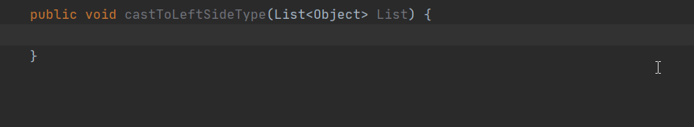

When the variable assigned with the current item from the iteration has a different type than the items in the collection, then the casting gets
inserted for the new type.

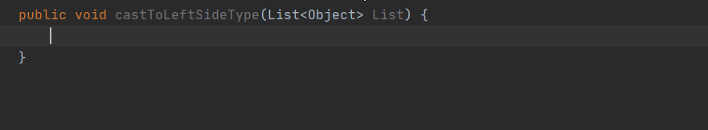

Having the collection's generic type specified as a wildcard or a more complex one with upper/lower bounds doesn't change the behaviour outlined above.

**Related macro:** [CastToLeftSideTypeMacro](https://github.com/JetBrains/intellij-community/blob/master/java/java-impl/src/com/intellij/codeInsight/template/macro/CastToLeftSideTypeMacro.java)

## className()

Returns the name of the current class (the class where the template is expanded).

Let's say you need a static slf4j logger in your class fully initialized. A live template for that may look like this:

```java
private static final org.slf4j.Logger LOGGER = org.slf4j.LoggerFactory.getLogger($CurrentClass$.class);
```

where the `getLogger()` method must be parameterized by the current class name.

To populate that part automagically you can configure the Expression part of the `$CurrentClass$` variable to `className()`.
That way the parameter will always take the name of the class the logger is placed in.

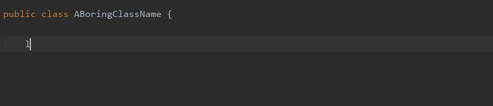

If the class has a generic parameter type as well, this macro won't insert that type, simply the name of the class.

**Related macro:** [ClassNameMacro](https://github.com/JetBrains/intellij-community/blob/master/java/java-impl/src/com/intellij/codeInsight/template/macro/ClassNameMacro.java)

## classNameComplete()
	
This expression substitutes for the class name completion at the variable position.

Let's say you would like to insert a snippet of for validating whether an object is an instance of a type, via AssertJ.
A live template might be:

```java
org.assertj.core.api.Assertions.assertThat($instance$).isInstanceOf($Class$.class);
```

If you configure the `$Class$` variables Expression with `classNameComplete()`, then suggestions are offered at the place of that variable for any kind of types
including classes, interfaces, etc.

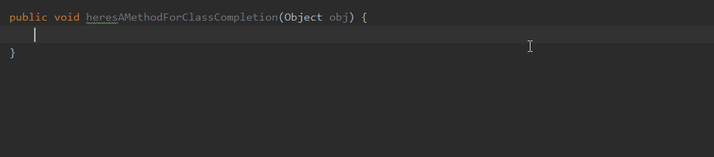

**Related macro:** [ClassNameCompleteMacro](https://github.com/JetBrains/intellij-community/blob/master/platform/lang-impl/src/com/intellij/codeInsight/template/macro/ClassNameCompleteMacro.java)

## defaultReturnValues / errorVariableName

Returns the default value if the expression is used in the return statement. Uses the errorVariableName parameter if the expression is of the error type.

NOTE: these are variable names and not macros, and seem to be available only in WebStorm, Rider and GoLand

## descendantClassesEnum(String)

Returns the children of the class specified as a string parameter.

The returned list (collection of fully qualified names as Strings) includes the children regardless of what types they are: interface, class, abstract class or enum.
However, the list doesn't include the type the macro is invoked with. 

In case the type, specified as argument for the macro, has no child, then an empty result list is returned. This includes
enums that by design cannot be inherited from.

Based on a small set of classes the order of elements in the result is hierarchical from the upmost inheritance level to the lowest one,
while the elements on the same level are ordered somewhat differently. (I haven't been able to figure out the logic. TODO)
However, they don't seem to be grouped in any way (e.g. interfaces, abstract classes, ...).

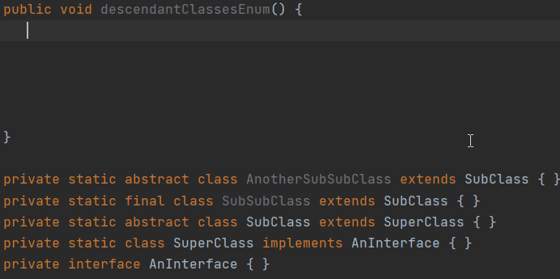

Based on a bigger set of type, e.g. `descendantClassesEnum("java.util.List")`, the ordering doesn't seem to follow this pattern, but the order of items is always
the same for multiple subsequent triggers.

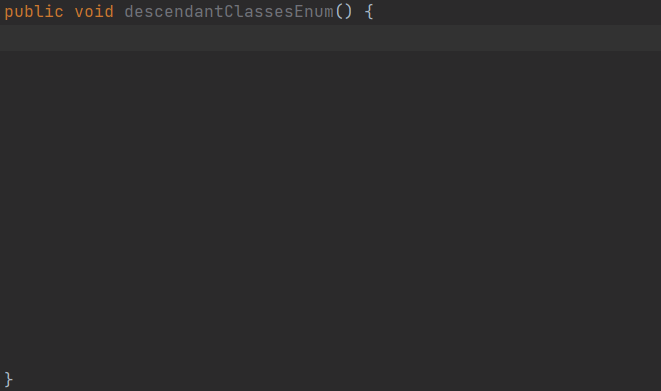

The scope of search is the current project and 3rd-party libraries as well.

**NOTES:**

- Take into account that using this macro for classes or interfaces that have tens or even hundreds of descendants will have an impact
on displaying the result list because collecting the information may take a couple of seconds.
- Although having a filtered result list returned might be possible by embedding this macro into another one that does the filtering,
collecting the descendants will still take the same amount of time as it would without filtering the end result.
- The official documentation contains this macro as `descendantClassEnum(String)` but within the IDE it is actually called `descendantClassesEnum(String)`.

For a slightly different behaviour you can check out the [subtypes()](#subtypesstype) macro. 

**Related macro:** [DescendantClassesEnumMacro](https://github.com/JetBrains/intellij-community/blob/master/java/java-impl/src/com/intellij/codeInsight/template/macro/DescendantClassesEnumMacro.java)

## enum(sCompletionString1,sCompletionString2,...)

Returns a list of comma-separated strings suggested for completion when the template is expanded.

Selenium's `By` type fields/variables might be a good candidate to demonstrate this macro. A template text might be the following:

```java
final org.openqa.selenium.By $by$ = By.$strategy$("$selector$");
```

One might configure the Expression part of `$strategy$` with `completeSmart()` which would provide suggestions for all available methods (locator strategies) under `By`. 
However usually people only use a portion of these strategies so you may want to limit the number of suggested items that you can do with the `enum(...)` macro.

You can define a list of Strings that will be populated into the suggestions list. In this case the list could be limited to cssSelector, id and className which three might be the three most commonly
used ones.

So, the Expression part of `$strategy$` will be. If you want to save time further you can also set the default value for this variable to your desired one, e.g. `"cssSelector"`.


**Related macro:** [EnumMacro](https://github.com/JetBrains/intellij-community/blob/master/platform/lang-impl/src/com/intellij/codeInsight/template/macro/EnumMacro.java)

## expectedType()

Returns the expected type of the expression into which the template expands. Makes sense if the template expands in the right part of an assignment, after return, and so on.

**Related macro:** [ExpectedTypeMacro](https://github.com/JetBrains/intellij-community/blob/master/java/java-impl/src/com/intellij/codeInsight/template/macro/ExpectedTypeMacro.java)

## guessElementType(<container>)

Makes a guess on the type of elements stored in a java.util.Collection. To make a guess, IntelliJ IDEA tries to find the places where the elements were added to or extracted from the container.

**Related macro:** [GuessElementTypeMacro](https://github.com/JetBrains/intellij-community/blob/master/java/java-impl/src/com/intellij/codeInsight/template/macro/GuessElementTypeMacro.java)

## methodName()

Returns the name of the method in which the template is expanded.

Let's say you want to do some logging for a value which includes the current method's name. A template might be:

```java
LOGGER.info("Logging happened in method named: $method$");
```

Then you can configure the `$method$` variable's expression to call `methodName()`.

In action it will work as below:

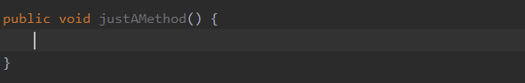

**Related macro:** [MethodNameMacro](https://github.com/JetBrains/intellij-community/blob/master/java/java-impl/src/com/intellij/codeInsight/template/macro/MethodNameMacro.java)

## methodParameters()

Returns the list of parameters of the method in which the template is expanded.

This macro returns the list of parameter names only in the form of `[param1, param2, param3, ...]`. It doesn't return the parameter types.


When the method the template is expanded in has no parameter then this macro will return `[]`.


**Related macro:** [MethodParametersMacro](https://github.com/JetBrains/intellij-community/blob/master/java/java-impl/src/com/intellij/codeInsight/template/macro/MethodParametersMacro.java)

## methodReturnType()

Returns the type of the value returned by the current method (in which the template is expanded).

This macro returns the fully qualified name of the return type of the method. You can see some combinations below
for return types and what the macro returns:

- `void`: void
- `String`: java.lang.String
- `List<String>`: java.util.List<java.lang.String>
- `List<T>`: java.util.List<T>
- List< ? >: java.util.List<?>
- `BiConsumer<String, String>`: java.util.function.BiConsumer<java.lang.String,java.lang.String>

One potential use case may be that if there is a method with an actual return type,
there might be a need for an object, maybe the result of some computation that will be returned. A template might be:

```java
$returnType$ result;
$END$
return result;
```

Then if you configure `$returnType$`'s Expression with `methodReturnType()` the template can used as following:


**Related macro:** [MethodReturnTypeMacro](https://github.com/JetBrains/intellij-community/blob/master/java/java-impl/src/com/intellij/codeInsight/template/macro/MethodReturnTypeMacro.java)

## qualifiedClassName()

Returns the fully qualified name of the current class (in which the template is expanded).

For classes:

```java
package com.project;

public class Converter {
    
    private static final class Properties {
    }
}
```

the `qualifiedClassName()` would return the following values:
- `com.project.Converter` for Converter
- `com.project.Converter.PonyProperties` for Properties

Make sure that the **Shorten FQ names** option is not enabled because in that case this function produces the same result as the `className()` macro.

For instance this macro may be used as part of a logger field initialization when passing the fully qualified name of the current class as a String.

For that a template might be:

```java
private static final org.slf4j.Logger LOGGER = org.slf4j.LoggerFactory.getLogger("$qualifiedClass$");
```

where `$qualifiedClass$`'s Expression is configured with `qualifiedClassName()`.

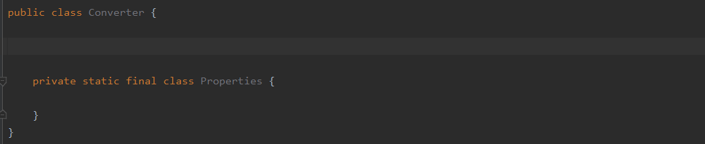

**Related macro:** [QualifiedClassNameMacro](https://github.com/JetBrains/intellij-community/blob/master/java/java-impl/src/com/intellij/codeInsight/template/macro/QualifiedClassNameMacro.java)

## rightSideType()

Declares the left-side variable with a type of the right-side expression.
It is used in the iterations group to have a single template for generating both raw-type and Generics Collections.

For this example I'm using the template called `itco` - **Iterate elements of java.util.Collection**:

```java
for($ITER_TYPE$ $ITER$ = $COLLECTION$.iterator(); $ITER$.hasNext(); ) {
  $ELEMENT_TYPE$ $VAR$ =$CAST$ $ITER$.next();
  $END$
}
```

in which the `$ITER_TYPE$` variable is configured with the `rightSideType()` macro.

The generic type of the iterator always matches the source collection's generic type regardless of there is one or not.

When there is none:

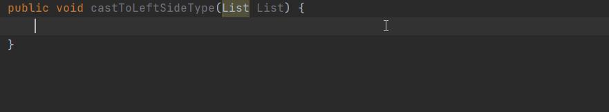

When there is one specified:

)

**Related macro:** [RightSideTypeMacro](https://github.com/JetBrains/intellij-community/blob/master/java/java-impl/src/com/intellij/codeInsight/template/macro/RightSideTypeMacro.java)

## subtypes(sType)

Returns the subtypes of the type passed as the parameter.

The result list in this macro is slightly different than what is returned by [`descendantClassesEnum()`](#descendantclassesenumstring).
Here:
- the items in it are actual types with their proper icon and visual representation 
- you can invoke the quick documentation popup showing their class level documentation comments
- the type that the macro is invoked with is shown too.

Using the macro on an expression as `subtypes("java.util.List")` yields the following result:

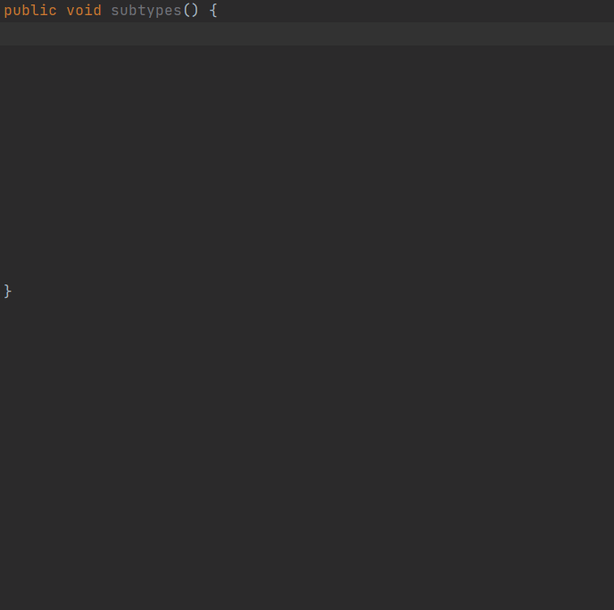

**Related macro:** [SubtypesMacro](https://github.com/JetBrains/intellij-community/blob/master/java/java-impl/src/com/intellij/codeInsight/template/macro/SubtypesMacro.java)

## typeOfVariable(VAR)

Returns the type of the variable passed as the parameter.

**Related macro:** [TypeOfVariableMacro](https://github.com/JetBrains/intellij-community/blob/master/java/java-impl/src/com/intellij/codeInsight/template/macro/TypeOfVariableMacro.java)

## variableOfType(<type>)

Suggests all variables that may be assigned to the type passed as the parameter, for example, `variableOfType("java.util.Vector")`.
If you pass an empty string "" as the parameter, the function suggests all variables regardless of their types.

Quoting from a related [JetBrains support ticket](https://intellij-support.jetbrains.com/hc/en-us/community/posts/360007850440-Live-template-How-does-suggestFirstVariableName-macro-work-) (kudos to Olga Klisho):

> [`suggestFirstVariableName`](misc.md#suggestfirstvariablenamesfirstvariablename) macro is the same as `variableOfType`, both suggest variables of the given type available in the context,
> but the latter one also suggests "standard expressions" if they have a compatible type: "true", "false", "this" and "Outer.this".

> The arguments can look like `"double"` or `"java.util.Collection"` or other macros, e.g. `methodReturnType()`
> which returns the return type of the method where the caret is positioned.

### Primitive types

Primitive types can be specified by their names as the macro's parameter, like: `variableOfType("short")`.

Let's say you have the index of some special days stored in `short` type fields, and with a live template you'd like to
create `short` variables with name suggestions.

```java
short $aSpecialDay$ = $day$;
```

Then you can configure the `$day$` variable's Expression as `variableOfType("short")`.

In case of specifying a primitive type as the parameter of this macro, the suggestions list
will show variables of their respective non-primitive types as well (including `java.lang.Void` for the keyword `void`).

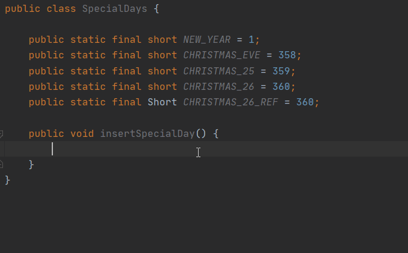

### Non-primitive types

Let's say you are doing UI test automation with Selenium, and you have a bunch of Page Object classes that all extend a base class.

This base class has a method with which you can query a custom HTML attribute in your application, from a `WebElement` , in a more readable way:

```java
public String customDataAttrOf(WebElement element) {
    //return custom attribute value from 'element'
}
```

If you create a template for inserting this method e.g.:

```java
customDataAttrOf($WebElement$);
```

you can also configure the `$WebElement$` variable's Expression to be `variableOfType("org.openqa.selenium.WebElement")` so that when inserted,
all the WebElement type variable names are shown as suggestions.

Variable names with the specified type are collected from super classes as well.


If you pass a type into the macro but not with its fully qualified name, e.g. `"WebElement"` instead of `"org.openqa.selenium.WebElement"`, and you have
a custom type with the same name, then upon insertion, the suggestions will show variables only whose type is actually imported into the current class.

When you are aware of that multiple types with the same name might exist and be available in your project, it might be better to use fully qualified names,
otherwise the simple name of the type may be more feasible.

 

### Macros

Other macros that return a type can also be specified as the parameter of this macro, so that this one will suggest variable names
according to the returned type.

One example is [`methodReturnType()`](types.mdturntype), in which case the Expression will be `variableOfType(methodReturnType())` when configured in a template variable.

In case it doesn't find a variable with the returned type, then the suggestions list will be empty.

### Edge cases

This macro accepts exactly one parameter, so either there is no parameter, or multiple parameters specified the suggestions list will be ewmpty. 

**Related macro:** [VariableOfTypeMacro](https://github.com/JetBrains/intellij-community/blob/master/java/java-impl/src/com/intellij/codeInsight/template/macro/VariableOfTypeMacro.java)

## expressionType(Expression)

NOTE: This is not included in the official documentation at the moment.

**Related macro:** [ExpressionTypeMacro](https://github.com/JetBrains/intellij-community/blob/master/java/java-impl/src/com/intellij/codeInsight/template/macro/ExpressionTypeMacro.java)
